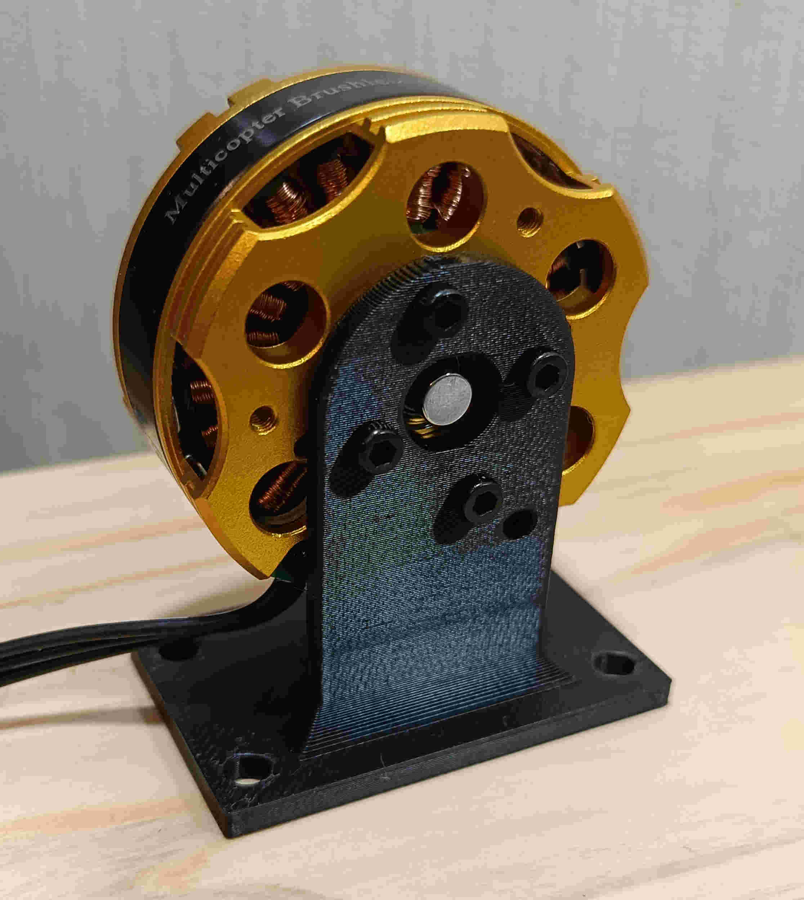
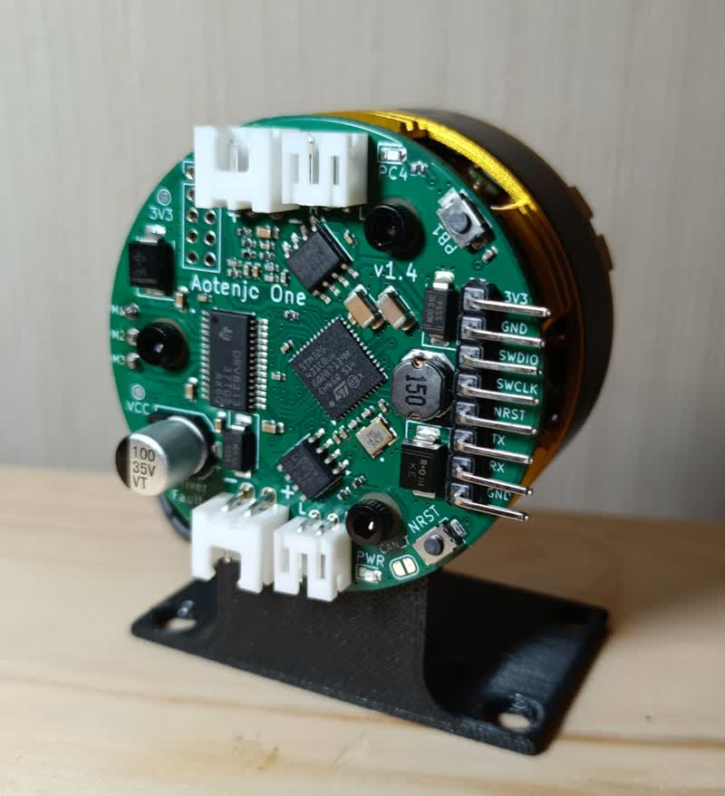

# BE4108
[Step file](./BE4108.step) | [STL file](./BE4108.stl)

Since I measured the dimensions with a cheap caliper, this is that not accurate.

## Dimensions

## BE4108 Motor Stand
[Step file](./stand/BE4108-motor-stand-3D-printed.step) | [STL file](./stand/BE4108-motor-stand-3D-printed.stl)

[Dimensions of the motor stand](./stand/motor-stand-dimensions.pdf)

